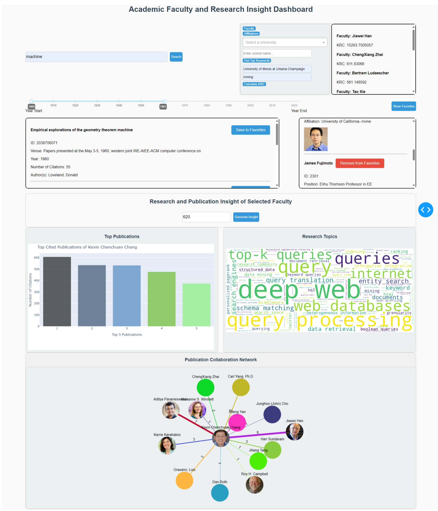

# **Academic Research and Faculty Insight Dashboard**

## Purpose
The Academic Faculty and Research Insight Dashboard is designed to support academic institutions, research departments, and individual students by providing comprehensive insights into faculty members and their research activities. This centralized platform allows users to access detailed information about faculty members, their publications, and collaborative networks, facilitating a deeper understanding of academic research and its impact.

## Demo
[Link to video demo](https://mediaspace.illinois.edu/media/t/1_la8cbdwo)

## Installation
This project utilizes the AcadmeicWorld datasets stored in three copies in MySQL, MongoDB, and Neo4j database systems. Maje sure to have python and necessary dependencies installed. 

## Usage
1. Run the application by executing `python app.py` in your terminal. 
2. Open your web browser and navigate to `http://127.0.0.1:8050` to access the dashboard.
3. Use the tags and dropdown menu to identify faculty and research keyword of interest. 
4. Use the search bar to find faculty members or publications.
5. Use the buttons to save or remove items from favorites.
6. Explore various visualizations such as the research topic word cloud, top-cited publications graph, and collaboration network.

## Design
### Overall Architecture
- **Frontend**: Developed with Dash, it provides an interactive web interface.
- **Backend**: Utilizes FLASK and python packages to send and receive queries to read and update the databses and handle REST API requests. 
- **Database**: Integrates MySQL, MongoDB, and Neo4j for managing various types of data.

### Components
#### Widget 1: Tags and Dropdown Menu
The top right side of the dashboard contains tags and buttons.
Click the "Faculty" button to display the total number of faculty. Click the "Affiliations" button to show all affiliations. Click the "Get Top Keywords" button to view top keywords for a specific school. Enter the school name in the input box that appears. Click the "Calculate KRC" button to calculate the Keyword Research Contribution (KRC) for a specific school and keyword. Enter the school name and keyword in the input boxes. A dropdownm menu allows user to select a university from the dropdown list to view the faculty-to-university ratio. The MongoDB and Neo4j databases are utilized fo this component. 

#### Widget 2: Search and Results Display
The top left side of the dashboard contains a search bar that allows searching for faculty by name and publication by title. Below contains a year-range slider. The slider allows user to limit publications result by a year range. Each returned search result also features a "Save to Favorite" button that save that faculty/publication to the favorite databases. The MySQL database is utilized for this component. 

#### Widget 3: Favorite Faculty and Publication
An info fox on the right side that depicts users' favorite professor and publication information to the database. Each depicted professor and publication contains a "Remove from Favorite" button that update the favorite databases. The MySQL database is again utilized for this component. 

#### Widget 4: World cloud
Widgets 4, 5, 6 are visualizations generated by entering a faculty's ID (provided in the Search result generated by Widget 2) and clicking the "Generate" button. This component is a word cloud of the research topics of the selected faculty, based on the keyword scores of all his/her publications. This uses the MySQL database. 

#### Widget 5: Interactive Top Publication Graph
At the bottom left, the top publication graph on the bottom left is a bar chart. It displays the number of citations for the top 5 publications of a selected faculty member. Hover over the bars to see the publication titles and citation counts. This utilizes queries for the MySQL databases. 

#### Widget 6: Publication Collaboration Network Graph
At the very bottom. The interactive network graph visualize the collaboration network of faculty members. Nodes represent faculty members, and edges represent the number of co-authorship publications. This component requires querying both MySQL and Neo4j databases. 

## Implementation
#### Frameworks and Libraries
The dashboard is implemented using Dash(mySQL, MongoDB, new4j) and Flask(neo4j) for the web framework, Plotly for visualizations, and Cytoscape for network graphs. Additional libraries: Included WordCloud for generating word clouds and various utilities for database interactions.

#### Data Handling
Data is fetched from MongoDB, MySQL, and Neo4j databases using custom utility functions (mongodb_utils, mysql_utils, neo4j_utils). The data is then processed and visualized in the dashboard.

## Database Techniques
#### Indexing
In the provided code, MongoDB is utilized to manage faculty and publication data. The code includes functions to create indexes, search collections, and perform various queries.

##### - Purpose
Indexes improve the performance of search queries by allowing the database to quickly locate and access the data without scanning the entire collection.

##### - Implementation
The create_indexes function creates indexes on specific fields in the MongoDB collections.

##### - Querying
The search_collection function allows searching within a specified collection based on a query. This is used to fetch data dynamically based on user input.

##### - Aggregation
The code uses aggregation pipelines to perform complex data processing tasks. For example, `calculate_krc` and `top_keywords_by_school` use aggregation to calculate the Keyword Research Contribution (KRC) and top keywords, respectively.

#### View
In the provided code, MySQL is used to manage and query structured data related to the year of publication. The year-range slider creates a view of the publication table that only includes tuples within that year-range. 

##### - Purpose
Views are virtual tables representing the result of a database query. They provide a way to encapsulate complex queries and present a simplified interface to users.

##### - Implementation
The `search_by_year` function creates a view `year_publication` that filters publications based on a specified year range.

##### Querying
Functions like` search_publication_by_title` perform SQL queries to fetch data based from view tables. 

#### REST API for accessing databases
The provided code uses Flask to create a REST API for handling requests and providing data to the front-end application.

##### - Purpose
A REST API allows clients (like web browsers or other applications) to communicate with the server and perform actions or retrieve data using HTTP methods like GET, POST, PUT, and DELETE.

##### - API Route
The code defines an API route `/api/get_university_faculty_ratio` to handle GET requests.

##### - Request Handling
The API route `/api/get_university_faculty_ratio` accepts a university name as a query parameter and returns the faculty ratio data in JSON format.

##### - Error Handling
The API includes error handling to return appropriate error messages and status codes in case of missing parameters or other issues.

## Extra-Credit Capabilities
### Advanced Word Cloud Visualization
Advanced word cloud visualization that provides a cool visual summary of a faculty's research interest. The larger a keyword is in the word cloud, the more often and relevant that research topic is featured in the faculty's publications. 

### Publication Collaboration Network Graph 
Network graph utilzing the Cytoscape library that displays a faculty and his/her collaborators in publication. This visualizations provide an intuitive depiction of research network of a faculty and encourages further exploration. The implementation of this function also requires multi-database querying. 

### Multi-database Querying
The `update_publications_graphs` function in `app.py` exemplifies multi-database querying by:

- Querying **MySQL** to fetch faculty publication data and research keywords:
  - `get_top_cited_publications`
  - `get_research_interest_frequencies`
  - `get_faculty_name_from_id`

- Using **MySQL** results (faculty name) to query **Neo4j** for collaboration data:
  - `get_faculty_nodes_for_faculty`
  - `get_collaborations_for_faculty`

- Combining results from both databases to update the visual components in the Dash application. This includes the updated figure for the top-cited publications graph, the source of the word cloud image, and the elements for the network graph.

## Contributions
**Ezra Hsieh**:
- Tasks: Front-end development, Dash layout, component integration, Plots UI design and implementation, some databse integration, and functions realizations.
- Time Spent: 40 hours

**Sheng-Hao Chen**:
- Tasks: Front-end development, Back-end development, Flask API creation, and database integration.
- Time Spent: 35 hours
